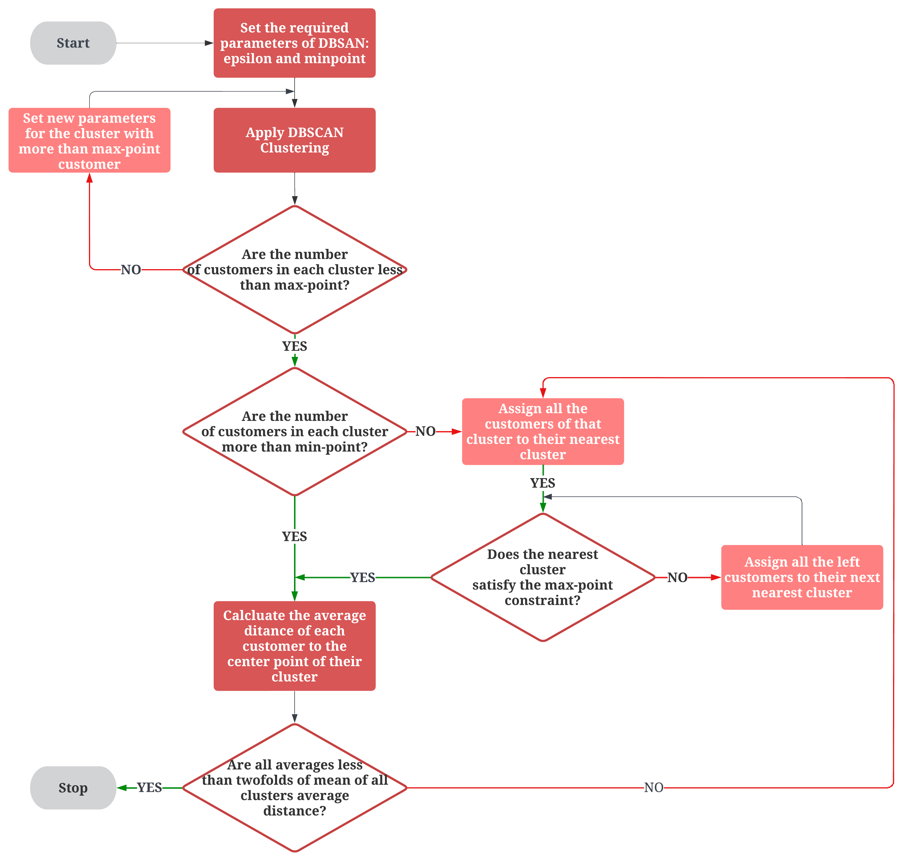

# Recursive_DBSCAN_VRP
This repository contains a recursive implementation of DBSCAN clustering for the Vehicle Routing Problem (VRP), enabling efficient clustering of delivery locations for optimal route planning. The flowchart of the process can be found in the attached image:  Additionally, the sample dataset input and its head are shown in the .ipynb file, which can be replicated based on your own dataset.

